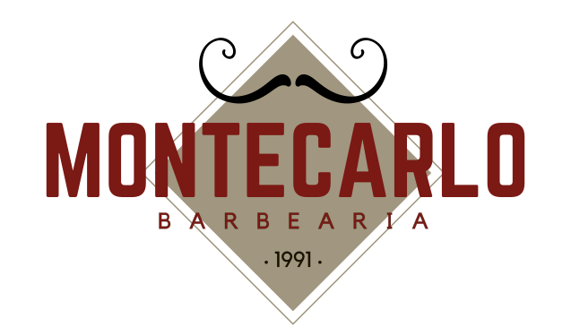
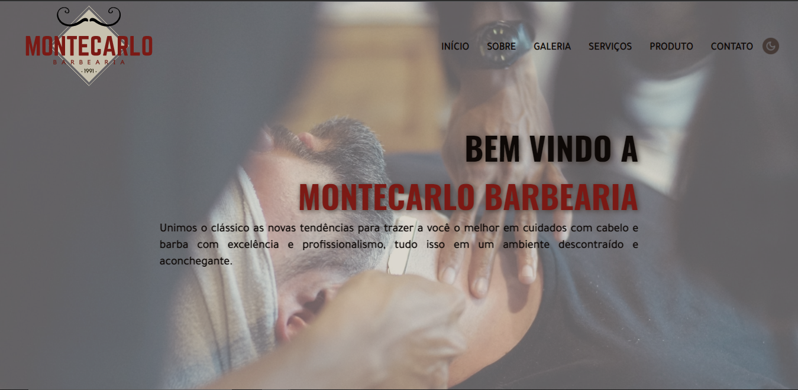
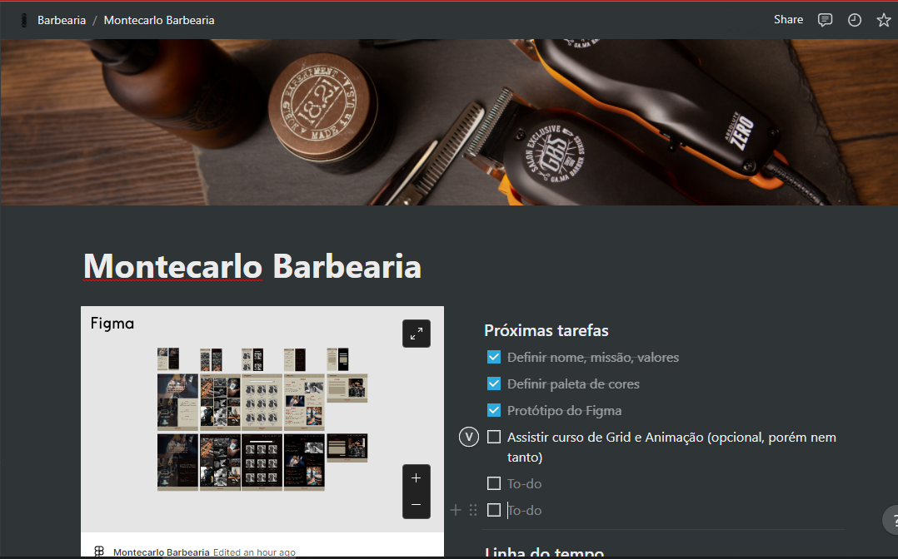
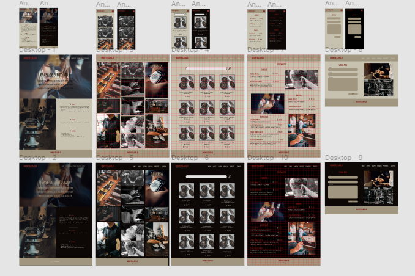

# Montecarlo Barbearia

### 💻 Sobre o projeto

 O propósito desse projeto foi desenvolver o front-end de uma página institucional de uma barbearia utilizando HTML, CSS e JavaScript. Durante sua execução, utilizamos o método Scrum para a divisão das tarefas e organização do tempo. 

 
	<strong>Status do projeto:</strong> Em desenvolvimento.

Veja em:

## 🛠️ Tecnologias utilizadas:

<ul align=justify>
    <li>HTML5: Linguagem de marcação;</li>
    <li>CSS3: Linguagem de estilização;</li>
    <li>Javascript: Linguagem de programação;</li>
    <li>jQuery - Biblioteca de funções JavaScript</li>
    <li>Canva: Criação do logo;</li>
    <li>Figma: Desenvolvimento do protótipo do layout da aplicação;</li>
    <li>Notion: Planejamento e documentação do projeto;</li>
    <li>Jira: Organização do backlog e gestão das sprints.</li>
</ul>

 

<strong>Notion</strong>

 
 

<strong>Figma</strong>

 

## 🤝 Autores

<strong> Bruno Sá

 Estudante de Desenvolvimento Web Full Stack

 

<strong> Vanessa Reis

 Estudante de Desenvolvimento Web Full Stack

